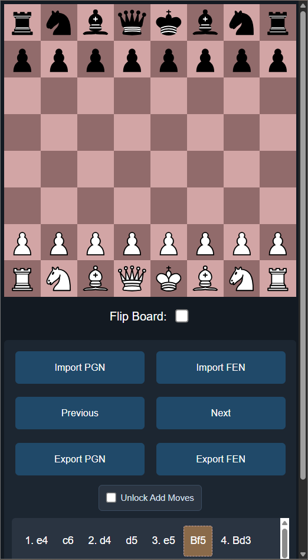
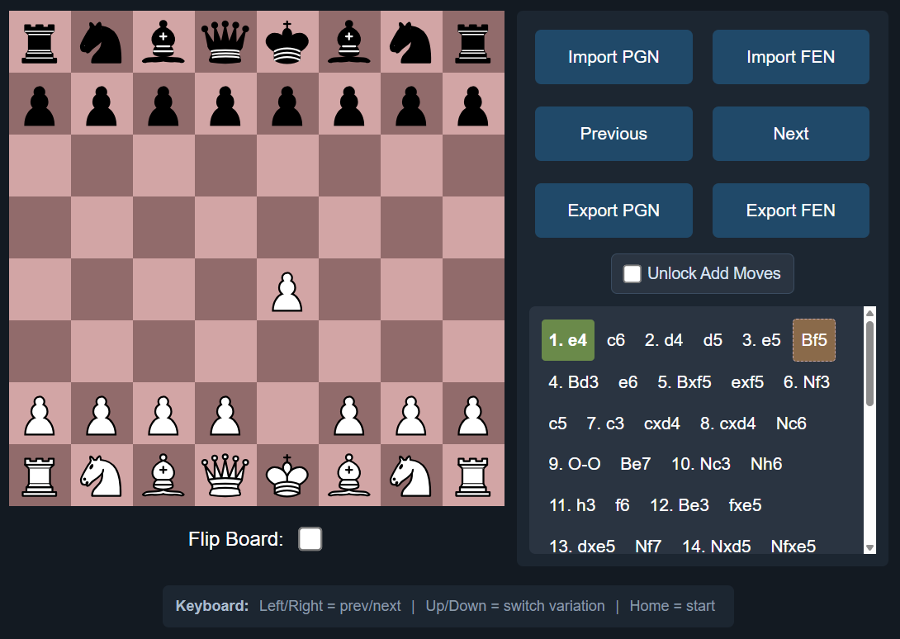
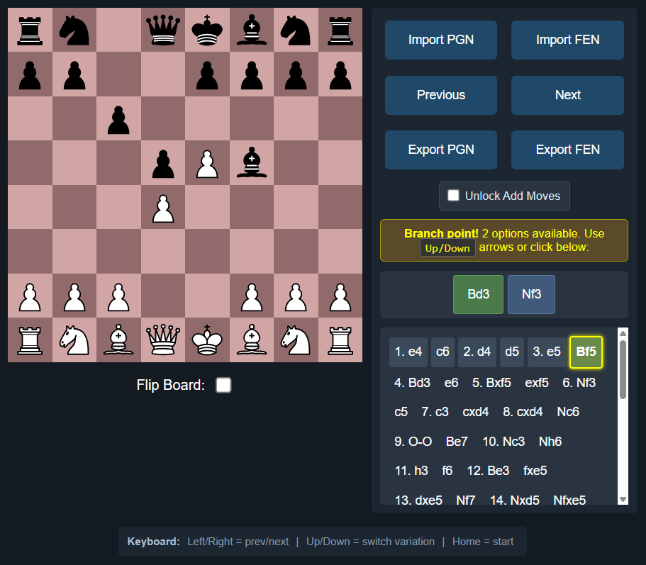
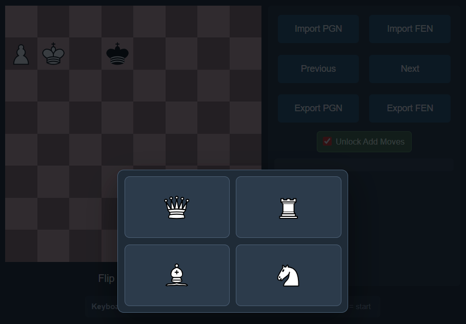

# Chess Trainer

Mobile-first chess line trainer for studying PGN repertoires with an interactive board.

## What It Does

- Loads and navigates PGN move trees (including variations).
- Lets you play moves on the board and validates them against current PGN branches.
- Supports both move input modes: click-click and drag-drop (mouse/touch).
- Supports branching practice with an `Unlock Add Moves` mode.
- Imports both PGN and FEN from overlays.
- Exports both PGN and FEN (clipboard-first with fallback import panels).
- Opens the current position in Lichess with one-click analysis.
- Handles pawn promotion with an in-page piece picker overlay.
- Keeps the move tree visually above controls for a cleaner mobile-first flow.

## Demo







## Getting Started

1. Clone the repo.
2. Open `main.html` in your browser.
3. Click `Import PGN` to load your study line (or use the default one).

No build step or server is required for basic local usage.

## Automated Tests

1. Install dependencies with `npm install`.
2. Run parser/serializer tests with `npm test`.

## Controls

- `Import PGN`: Open PGN import panel (`Load PGN` or `Close`).
- `Import FEN`: Open FEN import panel (`Load FEN` or `Close`).
- `Previous` / `Next`: Move through the current line.
- Board move input: click-click or drag-drop a piece to the target square (mouse or touch).
- Click moves in the PGN panel to jump directly.
- `Unlock Add Moves`: Allow adding new non-PGN moves into the active tree.
- `Export PGN`: Copy current PGN tree.
- `Export FEN`: Copy current board FEN.
- `Analysis`: Open Lichess analysis in a new tab for the current FEN.
- `Flip Board`: Switch board orientation (moved to lower controls for better mobile spacing).
- `Current Comment` panel: Displays the annotation text for the currently selected move.

## Keyboard Shortcuts

- `Right Arrow`: Next move
- `Left Arrow`: Previous move
- `Up / Down Arrow`: Switch variation
- `Home`: Go to start position
- `Esc`: Close open overlays

## Project Structure

- `main.html` - UI layout and overlays
- `style.css` - board, panel, and responsive styling
- `logic.js` - PGN parsing, move tree model, navigation, renderer
- `script.js` - UI behavior, board interaction, import/export flow
- `tests/` - parser and serializer fixtures/unit tests (`node:test`)

## PGN Annotation Support

Supported syntax:

- Standard comments: `{...}` and `; ...` (end-of-line)
- Variations: `( ... )`
- Numeric NAGs: `$1`, `$2`, ...
- Vendor tags inside comments:
  - Arrows: `[%cal Gg1f3,Rd1d7]`
  - Square highlights: `[%csl Ge4,Re5]`
  - Colors: `G`, `R`, `Y`, `B`

Runtime behavior:

- The board overlay draws all `%cal` arrows and `%csl` squares for the current move.
- The `Current Comment` panel shows the non-tag comment text for that move.
- Multiple arrows/squares per comment are supported.

Internal representation:

```js
Comment {
  text: "human text only",
  rawText: "original comment content",
  kind: "brace" | "line",
  tags: {
    cal: Arrow[],
    csl: SquareMark[]
  }
}

Arrow { color: "G" | "R" | "Y" | "B", from: "g1", to: "f3" }
SquareMark { color: "G" | "R" | "Y" | "B", square: "e4" }
```

## Notes

- The app is designed so board interaction stays central on small screens.
- PGN move highlighting scrolls inside the PGN panel only (no forced page scroll jump).
- Import overlays can be closed without applying changes.
- Drag-drop and click-click share the same validation flow (promotion, PGN branch matching, warnings, and unlock behavior).
- Press `Esc` to close overlays and cancel an in-progress drag gesture.
- Parser round-trip behavior: unchanged documents export their original PGN text; dirty trees use canonical serialization while preserving comments, NAGs, headers, and result.
